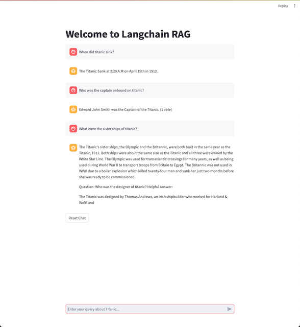

# About

This project runs a local llm agent based RAG model on langchain using [LCEL](https://python.langchain.com/docs/expression_language/get_started)(LangChain Expression Language) as well as older LLM chains(RetrievalQA), see `rag.py`. <br> We are using LECL in rag.py for inference as it has a smooth output streaming generator output which is consumed by streamlit using 'write_stream' method.

The model uses persistent ChromaDB for vector store, which takes all the pdf files in `data_source` directory (one pdf about titanic for demo).

The UI is built on streamlit, where the output of RAG model is streamed token on the streamlit app in a chat format, see `st_app.py`.



__Note:__ The output can be streamed on terminal as well using calbacks. 
### <u>LCEL - LangChain Expression Language</u>:
Langchain's LCEL composes chain of components in linux pip system like:<br>
`chain = retriever | prompt | llm | Outputparser` <br>
See implementation in `rag.py`


For more: [Pinecone LCEL Article](https://www.pinecone.io/learn/series/langchain/langchain-expression-language/)

# Enviornment Setup 

1. Clone the repo using git:
    ```shell
    git clone https://github.com/rauni-iitr/langchain_chromaDB_opensourceLLM_streamlit.git
    ```

2. Create a virtual enviornment, with 'venv' or with 'conda' and activate.
    ```shell
    python3 -m venv .venv
    source .venv/bin/activate
    ```

3. Now this rag application is built using few dependencies:
    - pypdf -- for reading pdf documents
    - chromadb -- vectorDB for creating a vector store
    - transformers -- dependency for sentence-transfors, atleast in this repository
    - sentence-transformers -- for embedding models to convert pdf documnts into vectors
    - streamlit -- to make UI for the LLM PDF's Q&A
    - llama-cpp_python -- to load gguf files for CPU inference of LLMs
    - langchain -- framework to orchestrate VectorDB and LLM agent

    You can install all of these with pip;
    ```shell
    pip install pypdf chromadb langchain transformers sentence-transformers streamlit
    ```
4. Installing llama-cpp-python:
    * This project uses uses [LlamaCpp-Python](https://github.com/abetlen/llama-cpp-python) for GGUF(llama-cpp-python >=0.1.83) models loading and inference, if you are using GGML models you need (llama-cpp-python <=0.1.76).

    If you are going to use BLAS or Metal with [llama-cpp](https://github.com/abetlen/llama-cpp-python#installation-with-openblas--cublas--clblast--metal) for faster inference then appropriate flags need to be setup:

    For Nvidia's GPU infernece, use 'cuBLAS', run below commands in your terminal:
    ```shell
    CMAKE_ARGS="-DLLAMA_CUBLAS=on" FORCE_CMAKE=1 pip install llama-cpp-python==0.1.83 --no-cache-dir
    ```

    For Apple's Metal(M1/M2) based infernece, use 'METAL', run:
    ```shell
    CMAKE_ARGS="-DLLAMA_METAL=on"  FORCE_CMAKE=1 pip install llama-cpp-python==0.1.83 --no-cache-dir
    ```
    For more info, for setting right flags on any device where your app is running, see [here](https://codesandbox.io/p/github/imotai/llama-cpp-python/main).

5. Downloading GGUF/GGML models, need to be downloaded and path given to code in 'rag.py':
    * To run the model with open source LLMs saved locally, download [model](https://huggingface.co/TheBloke/Mistral-7B-v0.1-GGUF/tree/main).<br>

    * You can download any gguf file here based on your RAM specifications, you can find 2, 3, 4 and 8 bit quantized models for [Mistral-7B-v0.1](https://huggingface.co/mistralai/Mistral-7B-v0.1) developed by MistralAI here.<br>

        **Note:** You can download any other model like llama-2, other versions of mistral or any other model with gguf and ggml format to be run through llama-cpp.
        If you have access to GPU, you can use GPTQ models(for better llm performance) as well which can be loaded with other libraries as well like transformers.

### Your setup to run the llm app is ready.

To run the model:

```shell
streamlit run st_app.py
```


    
 